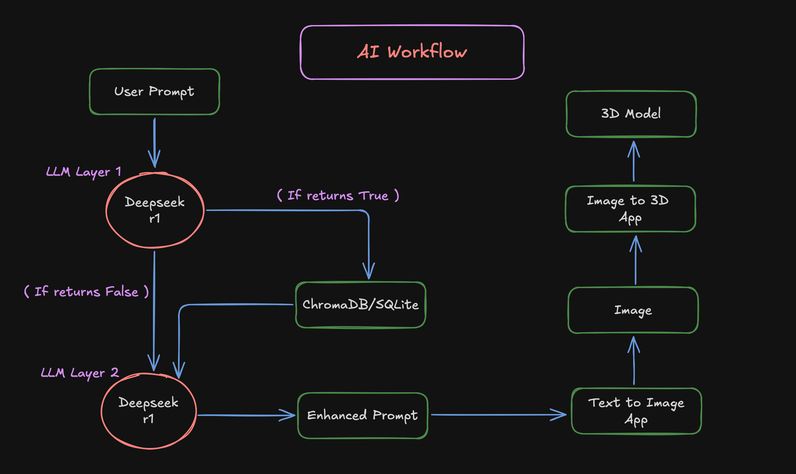
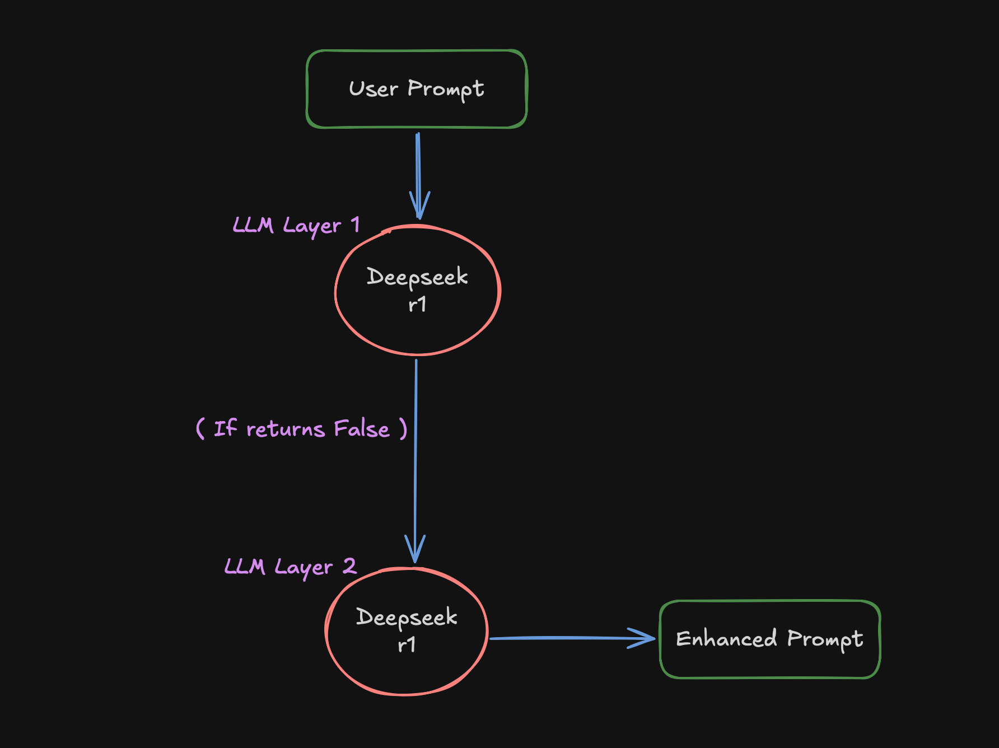
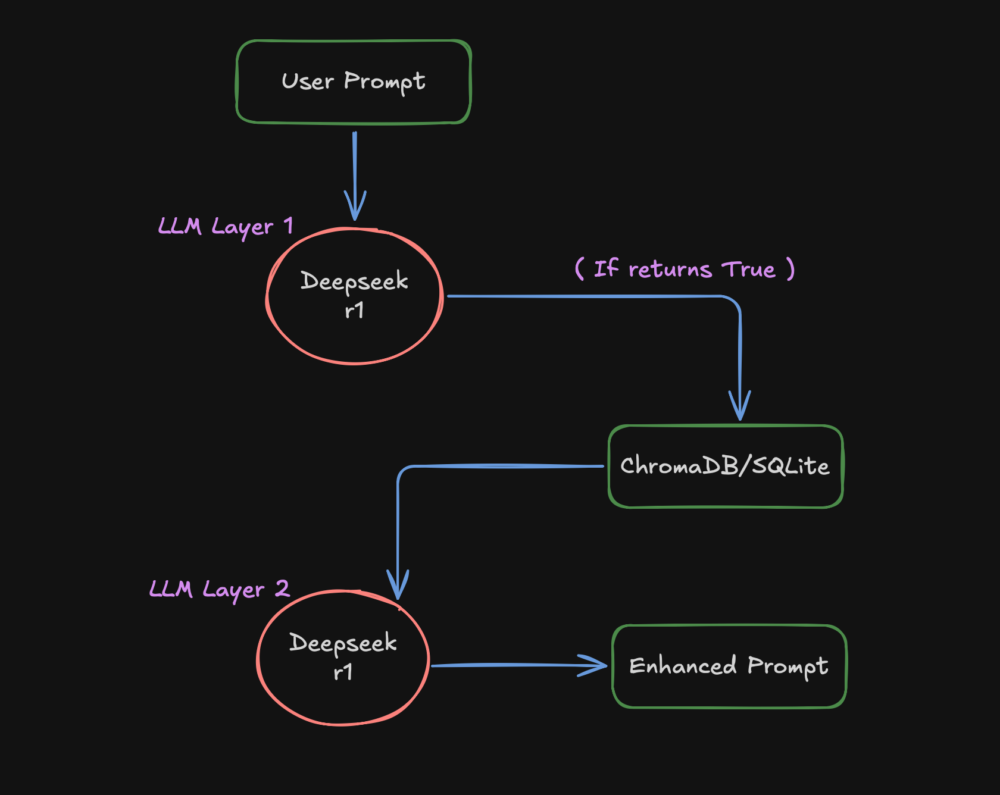

<h1 align="center">AI Creative Partner 🚀</h1>



[Video Explaination of the project]("have_to_give_link")

The **AI Creative Partner** is an advanced application built on the Openfabric platform that transforms simple user prompts into complex, multi-modal creations. It leverages a sophisticated pipeline of AI services to generate not just an image, but a full 3D model, all while maintaining context and learning from past interactions.

## 🛠️ Tech Stack

| **Category** | **Technology** | **Purpose** |
| :--- | :--- | :--- |
| **Platform** | Openfabric SDK | Provides the core framework for creating and connecting decentralized AI services. |
| **Orchestration** | Python | The primary language used for the backend logic and workflow orchestration. |
| **LLM Integration**| Ollama (`deepseek-r1:14b`) | Runs the local Large Language Models for prompt enhancement and intent analysis. |
| **Vector Database** | ChromaDB | Stores text embeddings for fast, semantic similarity search to find past creations. |
| **Relational Database**| SQLite | Stores the metadata associated with each creation, such as prompts and timestamps. |
| **Embeddings** | Sentence-Transformers | Generates the vector embeddings from text prompts for storage in ChromaDB. |
| **Dependencies** | Poetry | Manages Python package dependencies and virtual environments. |
| **Containerization**| Docker | Used to containerize the application for consistent deployment and execution. |

## Pipeline 🔄

### Step 1: Intent Analysis and Memory Access Decision

- When the user provides their prompt, we find the intent using **Deepseek r1:14b** model. Here we pass the current session history as context along with the current user prompt as input to the LLM, which determines whether to access long-term memory or not by returning **True** or **False**. 

- For example, when it returns **False** - given the current user prompt as input and the current session history as context, the LLM checks whether the user is referring to past interactions. If 'yes', it verifies if these interactions exist in the current session history. If 'yes', then we don't require long-term memory, so it returns **False**.

- When the First LLM Layer returns **False**, we skip retrieving data from long-term memory and proceed to the Second LLM Layer.

- The Second LLM Layer (**Deepseek r1:14b**) receives three parameters: current user prompt, current session history, and past context. In this case, we don't pass past context because we're not retrieving any past session conversations since the First LLM Layer returned **False**.

- In this scenario, the Second LLM Layer, having the current user prompt as input and current session history as context, first checks whether the user prompt refers to previous enhanced prompts within the current session history. If 'yes', it uses that enhanced prompt and modifies it according to the current user prompt requirements. If 'no', it enhances the user prompt from scratch.


**Why this step is Important:**

→ Given the user prompt just because user is referring to the past interactions we are not querying over database everytime, so we are saving resources, **Time** and improving **Latency**



### Step 2: Long‑Term Memory Retrieval

- If the user prompt refers to past session conversations given the current session history as context, the First LLM Layer returns **True**, which means we need to retrieve from long-term memory.

- For long term meomry we are using **ChromaDb + SQLite** (Let's understand what we are store)

    - **ChromaDB**: Since we need to re-create previous images that were generated using enhanced prompts, we store the enhanced prompts as embeddings with session IDs in metadata.

    - **SQLite**: Here we are storing session id, user prompt, enhanced prompt, timestamp in the database. 

- Since the First LLM Layer returned **True**, we convert the user query into embeddings and perform semantic search using cosine similarity to get relevant chunks with IDs. Using these IDs, we fetch data from the SQLite database (user prompt, enhanced prompt, and timestamp) and pass this as past context to the Second LLM Layer.

- The Second LLM Layer now has the current user prompt as input with past context as context. It first examines the past enhanced prompt and modifies it according to the current user requirements, returning a new enhanced prompt.



### Step 3: Prompt Enhancement

- When neither **current session history** nor **past context** is given, meaning the user prompt is brand new, the Second LLM Layer first identifies the subject of the user prompt and understands the objects mentioned. It tries to fit those objects naturally according to the description and additionally adds lighting and other visual effects that are relevant to the scene.

- When **current session history** is given, meaning the user is referring to the current session's enhanced prompt (Note: here we don't pass past context as it refers to the current session only), the Second LLM Layer considers this enhanced prompt and tries to modify it according to the current user requirements while improving it by adding visual effects to the scene.

- When **past context** is given, meaning the user is referring to a past session's enhanced prompt (Note: here we don't pass current session history as it refers to past context), the past context contains the previous user prompt, enhanced prompt, and timestamp. The Second LLM Layer gives preference to the enhanced prompt while also understanding the previous user prompt and timestamp as context, then modifies or adds to the current user prompt according to the user requirements.

### Step 4: Multi-Modal Generation

- The final enhanced prompt is first fed into the Text‑to‑Image app to generate a high quality image, then passed into the Image‑to‑3D app to produce a fully textured 3D model.

## ⚙️ Getting Started

Follow these instructions to get the application up and running locally.

### 1. Prerequisites

Make sure you have the following installed on your system:

* [Python 3.11+](https://www.python.org/downloads/)
* [Poetry](https://python-poetry.org/docs/#installation) (for Python dependency management)

### 2. Clone the Repository

```bash
git clone [https://github.com/karthikponna/openfabric_ai_test.git](https://github.com/karthikponna/openfabric_ai_test.git)
cd openfabric_ai_test
```

### 3. Install Dependencies

The project uses Poetry to manage dependencies. Navigate to the `app` directory and run the following command to install the required Python packages.

```bash
cd app
poetry install
```

### 4. Download Deepseek r1:14b model

The project uses Deepseek r1:14b model from ollama. Run below command to download it.

```bash
ollama pull deepseek-r1:14b
```

### 5. Check `8888` and `8501` are free:

Run below commands to see if local serves are free if not then kill the servers to restart.

```bash
lsof -i :8888
kill -9 <PID>

lsof -i :8501
kill -9 <PID>
```

### 6. Start ollama server 

Run below command to start the Ollama server in your first terminal.

```bash
ollama serve
```

## 7. Run your Streamlit app 🏃‍➡️

Make sure you have run the below command in the second terminal.

```bash
poetry run bash start.sh
```